# Office Attendance Tracker 🚶‍♀️‍➡️🏢

Code & Documentation for SE Summative One: **Office Attendance Tracker**. Created by: Isa Iman Zia

<details closed><summary>1. Introduction 🏫</summary>

## Overview

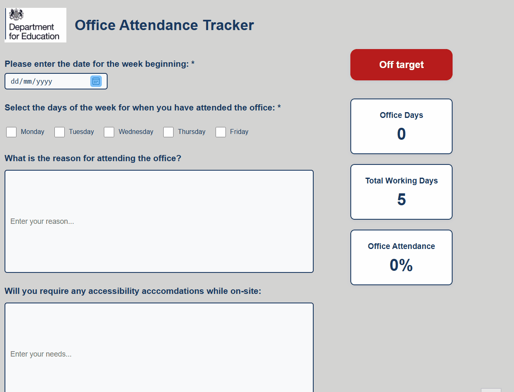

***Figure 1**: The most recent version of the application's layout is represented here.*

**Office Attendance Tracker** is a web-based application that is lightweight and intended to simplify the administration of employee attendance. The application enables users to view attendance history, and generate reports from a clean, responsive interface.

This app is ideal for: 

* **Department for Education (DfE) Colleagues** who require a rapid and effortless method to monitor their attendance records and record their working hours.
* **Senior Civil Servants (SCSs)** who are responsible for monitoring the attendance of their employees and ensuring that they are fulfilling their attendance goals.
* **Developers** seeking a front-end attendance solution that can be customised. 

</details>

<details closed><summary>2. User Guide 👥</summary>

## Key Features 🔑

* **Easy Attendance -** Select the days on which you were in the office each week with ease by selecting the corresponding checkboxes.
* **Reason & Accessibility Input -** Provide the rationale for your attendance and indicate any accessibility requirements in the form.
* **Attendance Summary Cards -** Visually appealing data panels provide instantaneous access to your attendance percentage, total office days, and total working days.
* **Target Status Indicator -** Quickly determine whether you are "On target" or "Off target" by examining your attendance percentage.
* **CSV Export -** Export your attendance data to a CSV file for convenient record-keeping or sharing.
* **Responsive & Accessible Design -** The application is intended to function seamlessly on a variety of devices and is accessible to all users.

## Getting Started

### Accessing the App

Access the Office Attendance Tracker through your web browser.  No installation is necessary; simply access the URL or view the index.html file locally. Access the Office Attendance Tracker through your web browser. No installation is necessary; simply access the URL provided or view the [index.html](index.html) file locally.

### System Requirements

* A contemporary web browser, such as Chrome, Edge, Firefox, or Safari
* Internet connection is required for online hosting

### First-time Setup

* Download or clone the project files to your computer if you are operating locally.
* To initiate the application, navigate to the index.html file in your browser.

## How to use the App

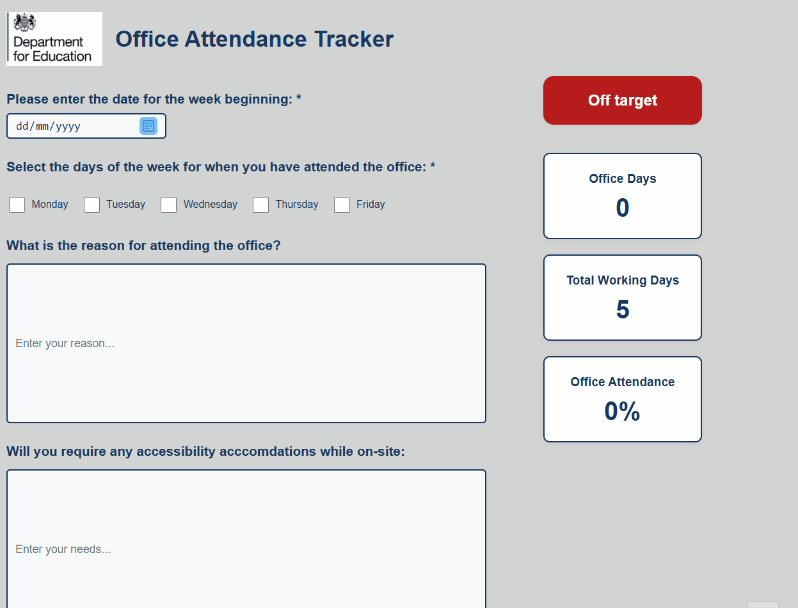

***Figure 2**: An animated GIF that illustrates the operation of the Office Attendance Tracker.  It also illustrates the functionalities that are involved.*

You will be presented with a form that requires you to input the commencement date of the week and select the days on which you were present at the office.  Fill in the necessary fields to initiate attendance monitoring. 

To comprehend the tracker's operation, consult the walkthrough above.

</details>

<details closed><summary>3. Developer Guide 🧑‍💻</summary>

## Installation and Setup Instructions

In order to execute the files successfully, the following are required: npm and node. Adhere to the subsequent procedures: 

1. **Check Node.js and npm installation**

```sh
node -v
npm -v
```

If both commands return version numbers, you are prepared to continue.  If not, obtain and install the Node.js package, which includes npm, from the following link: [Node.js download](https://nodejs.org/en)

2. **Clone the Repository**

```sh
git clone https://github.com/MrKilljoy137xxx/OfficeAttendance-Tracker.git
cd OfficeAttendance-Tracker
```

## Running tests

3. **Install Dependencies (for Testing)**

To execute tests, install the necessary package:

```sh
npm install
```

4. **Run the Application**

* Utilise your preferred web browser to access the index.html file.
* The application is purely client-side; no server configuration is necessary.

5. **Run Tests**

```sh
npm test
```

## Tech Stack Overview

* **Frontend:** HTML, CSS, JavaScript
* **Testing:** Jest (for unit testing JavaScript functions)
* **Version Control:** Git & GitHub

## Project Management

[View Kanban Board](https://github.com/users/MrKilljoy137xxx/projects/7)

## Product Design

[View Software Designs](https://www.figma.com/design/WJocdnGP8lz0KeOSZz0sVz/Office-Attendance-Tracker-Design-Plans?node-id=0-1&p=f&t=hLfXCABztxU3c7DL-0)

## Files to run the App

* index.html
* styles.css
* script.js

## Files used for Testing

* script.test.js
* package.json

## Codebase Structure

```
/
├── index.html          # Main HTML file
├── styles.css          # CSS styles
├── script.js           # Main JavaScript logic
├── script.test.js      # Jest unit tests
├── assets/             # Images and other static assets
└── README.md           # Project documentation
```

## Deployment Instructions

### Static Hosting (Recommended)

This application is a static web application that can be deployed on any static hosting service, such as GitHub Pages, that supports HTML, CSS, and JavaScript.

### Deploying to GitHub Pages

1. Push your project to a GitHub repository.
2. Access your repository's **Settings** and then navigate to the **Pages** section.
3. Select the root (**/**) folder and the branch (typically **main**) under **"Source"**
4. **Save**. Your site will be available at `https://your-username.github.io/your-repo-name/`.

</details>

<details closed><summary>4. Software Design 🎨 </summary>

## Design Principles

I was required to consider the application of deliberate design principles before creating the software designs. This will guarantee that the app is accessible and usable for all users within the DfE.  I have taken into account the following main principles:

**Clarity** was the initial principle that I examined.  This is the point at which I needed to guarantee that the user interface was both intuitive and aesthetically pleasing.  Additionally, I was required to guarantee that the office attendance rates of my users could be calculated and recorded through the use of distinct labels, buttons, and icons.

**Consistency** was the second principle that I evaluated.  This is the point at which I was required to adhere to common UI patterns, such as placing buttons at the bottom, and to maintain a consistent layout, typefaces, and colours across all pages.

**Accessibility** is the third design principle that I would prioritise.  This is the point at which I was required to guarantee that the keyboard navigation functioned properly and that the colour contrast between the text and the background was sufficient.  I was able to identify two colleagues in the department who had accessibility requirements and the corresponding colour scheme and font style to assist in addressing their needs.  I will elaborate on this later.

## User Personas & Empathy Maps

**User personas** are fictional representations of target users that aid in the comprehension of their demands, behaviours, objectives, and sore points.  They are essential for the purpose of designing with empathy and concentrating on the actual requirements of the user.  Features can be prioritised and UX can be improved by tailoring interfaces and interactions to specific user categories.  Utilising user personas, two distinct user categories were examined: a SCS user and a typical DfE colleague, with the objective of identifying their accessibility requirements and pain points.

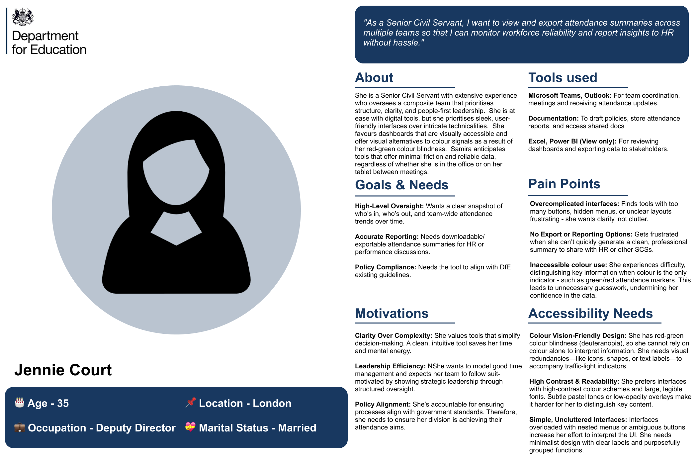

***Figure 3**: The User Persona of a SCS.*

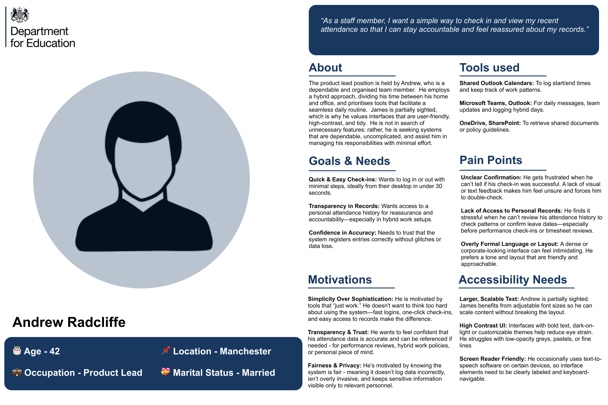

***Figure 4**: The User Persona of a normal DfE Colleague.*

By developing two **empathy maps** for colleagues, a collaborative visualisation tool that conveys user thoughts, emotions, words, and actions, the design process will be enhanced, thereby promoting a more profound comprehension among team members.

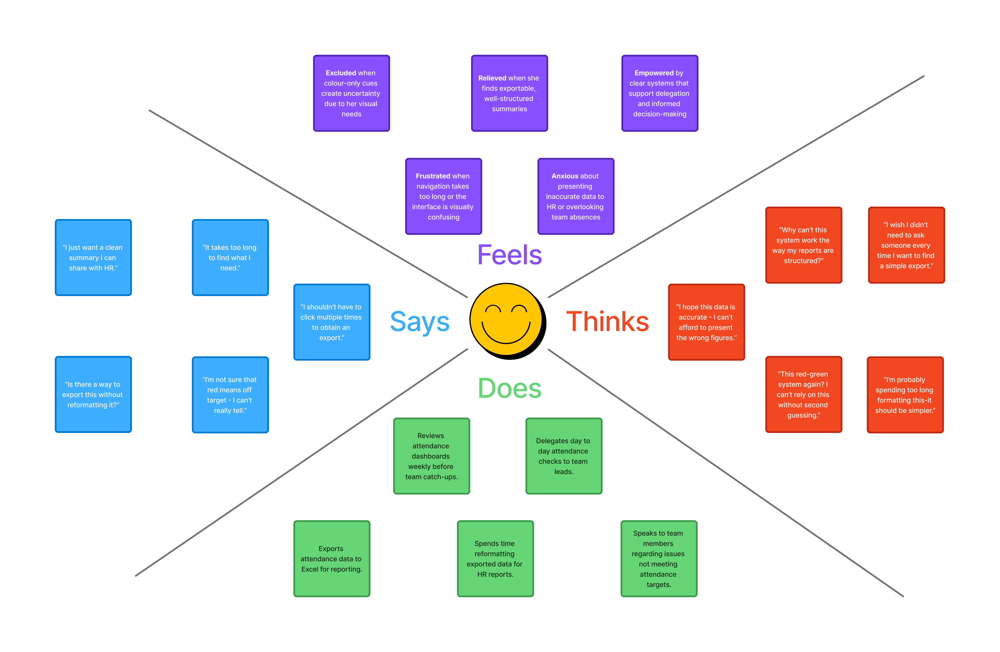

***Figure 5**: The empathy map of an SCS.*

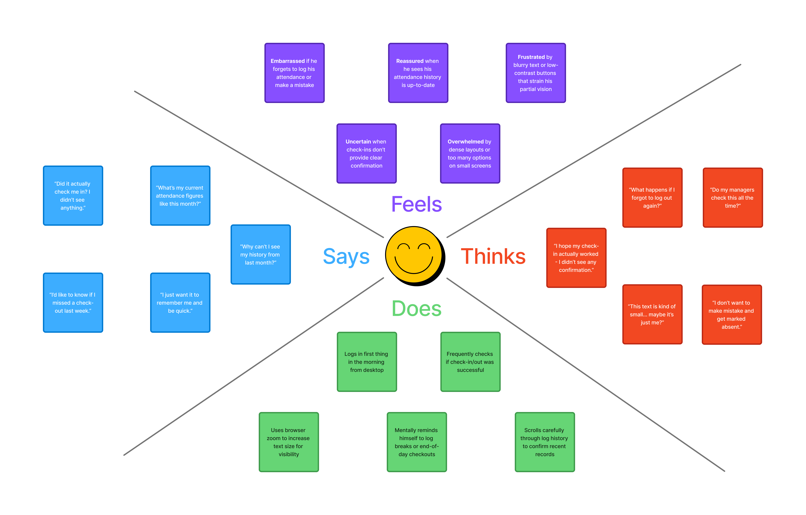

***Figure 6**: The Empathy Map of a normal DfE colleague.*

## UI Mockups

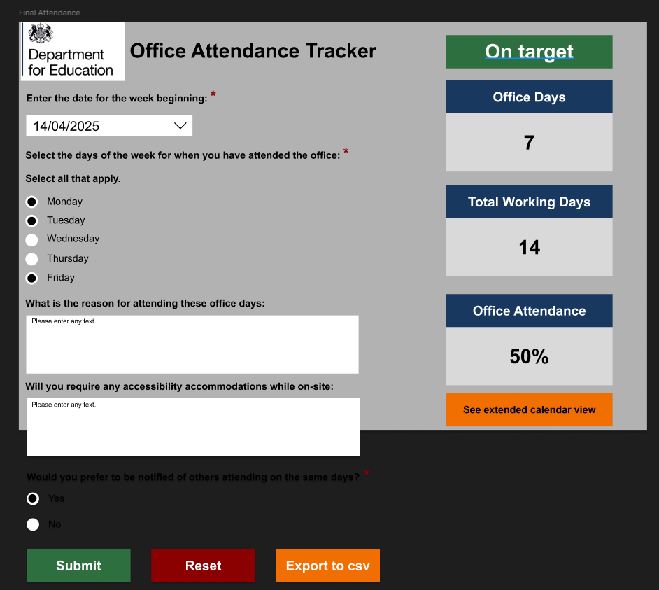

***Figure 7**: A wireframe of the Office Attendance tracker in Figma*

I utilised Figma to generate a preliminary wireframe design after collecting my user requirements, as illustrated in my empathy maps and user personas. Prior to investing in full development, Figma wireframes were an essential initial stage in the process of visualising, communicating, and refining the design of my application.

Ultimately, my stakeholders were satisfied with the app's design and subsequently granted authorisation for the complete development of the application.  The only modification they needed was to arrange the selection buttons for the second query horizontally, rather than vertically, in order to conserve space on the page.

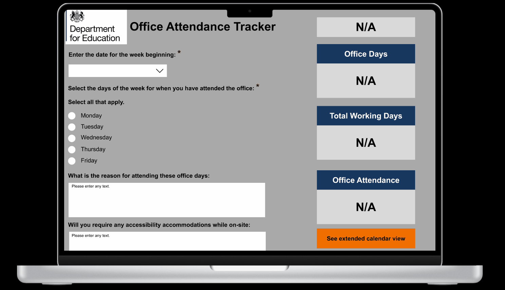

***Figure 8**: This is a live wireframe walkthrough that was conducted on Figma.*

The wireframe designs will be enhanced with each iteration cycle as a result of additional feedback from the stakeholders.

</details>

<details closed><summary>5. Project Planning📝</summary>

## Methodology

I utilised the Agile methodology to facilitate the development process.  This method of software development is iterative and adaptable, with a focus on the rapid incremental delivery of functional software, customer feedback, and collaboration.  Agile has enabled me to divide the project into smaller, more manageable units known as sprints, rather than planning the entire project in advance.  This will enable me to perpetually enhance the current tracker through the sprint cycles.

This is how I applied Agile to my workflow: 

* **Iterative Development-** The attendance tracker was constructed in incremental stages, with each feature (such as data cards, export, and target box) being added and enhanced in response to user feedback.

* **Continuous Improvement-** I conducted routine evaluations of the strategies that were effective and those that could be improved, implementing modifications as I worked.

* **Task Tracking-** I separated my work into manageable tasks (tickets), monitored my progress, and prioritised the most critical tasks by utilising GitHub issues and labels.  I will elaborate on this matter in the structure section.

## Structure

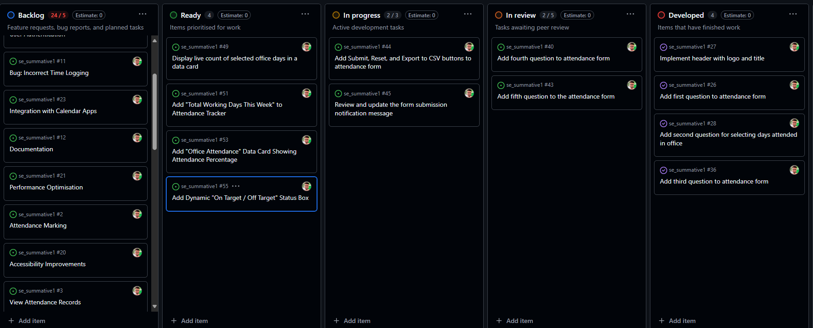

***Figure 9**: The Project Kanban board as it is presented in GitHub Projects.  This enabled me to coordinate the tickets (GitHub) across each stage of the development process.*

I have utilised a Kanban board through GitHub Projects and have compiled a list of all available assignments for Sprint 1.1. This facilitated the visual organisation and management of all my responsibilities during the software development lifecycle. The board was organised into the following columns: Backlog, Ready, In progress, In review, Developed, Testing, and Completed. GitHub issues were used to represent each task, feature, and bug, which were relocated across these columns as my work progressed.

The project was overseen by agile sprints, which were predetermined periods of time that enabled the creation of an office attendance tracker that was manageable. This method served to mitigate distress and enhance productivity. Also, the process enabled the assessment of successes and failings, which ultimately improved the quality of the product and process over time.

The development process entailed the sequential development of features through branches within a Git repository, ensuring that new features or problem solutions were developed in their respective branches. This ensured the stability of the code base. Pull requests were designated to the appropriate tickets in accordance with the branch naming conventions. This enhanced the organisation of developments and facilitated code evaluations, thereby guaranteeing the stability of the primary code base.

I conducted a sprint review at the end of each Agile development sprint, showcasing their product, gathering stakeholder feedback, and discussing improvements. The feedback was converted into technical requirements and incorporated into the Backlog. The Product Lead will review the Backlog to determine potential work for the next sprint, considering priorities and urgency.

## Ticket Labels

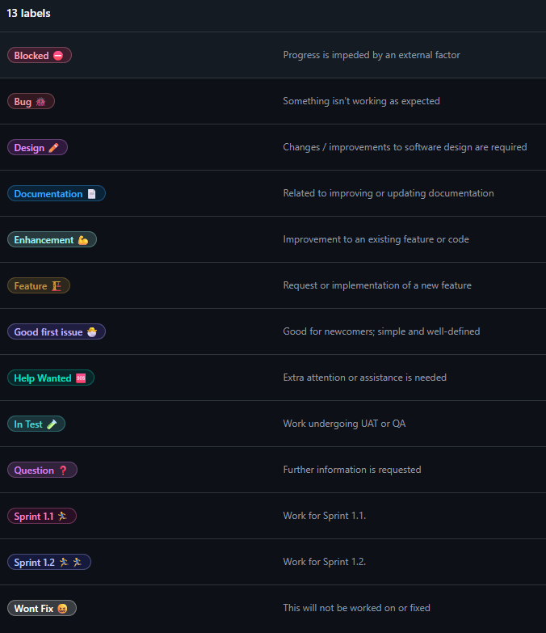

***Figure 10**: This displays the labels that were employed to organise the tickets.*

</details>

<details closed><summary>6. Development Process 🔧 </summary>

### Coding Journey

An interactive and structured coding journey was pursued in the development of the Office Attendance tracker:

* **Initial Setup -** The project commenced with the establishment of the fundamental HTML structure, which ensured semantic markup to promote clarity and accessibility.
* **Feature Driven Development -** Each feature (including the selection of office days, attendance calculation, and CSV export) was developed incrementally.  In order to facilitate focused development and seamless integration, features were implemented in distinct branches.
* **Styling and Responsiveness -** A clear, accessible, and responsive interface was generated through the utilisation of CSS. 
* **Interactive Functionality -** JavaScript was developed to manage dynamic updates, including the calculation of attendance percentages, the real-time updating of data cards, and the management of the on/off target status.
* **Accessibility and User Experience -** Accessibility was prioritised by employing appropriate labels and colour contrast throughout the journey. In order to enhance the interface and interactions, user feedback will be implemented.
* **Testing and Refinement -** User Acceptance Testing (UAT) is one of the various modes of testing that the application will undergo.  Github issues will be employed to monitor and resolve bugs, and the existing application will be enhanced in accordance with the results of the testing.
* **Version Control and Colloboration -** Git and Github were employed to facilitate collaborative development and code revision through the use of branches and pull requests for version control.

### Models Followed

The initiative adheres to a separation of concerns model:

* **HTML** for structure
* **CSS** for presentation
* **JavaScript** for behaviour

The UI logic is loosely based on the Model-View-Controller (MVC) pattern:

* **Model:** Data (e.g. selected days, attendance percentage)
* **View:** The interface is rendered using HTML and CSS.
* **Controller:** User input is processed by JavaScript functions that update the view.

</details>

<details closed><summary>7. Testing 🧪 </summary>

Test-Driven Development (TDD) is a software development methodology that enables me to generate automated tests for my code prior to composing the actual implementation. It is crucial for me to incorporate this into the OA tracker, as it will guarantee that the primary features function as intended and prevent the occurrence of bugs.

I will initially develop a test that defines a desired function or feature, execute it to observe its failure, subsequently compose the minimum code required to pass the test, and subsequently refactor as necessary.

**First Failing Test:**

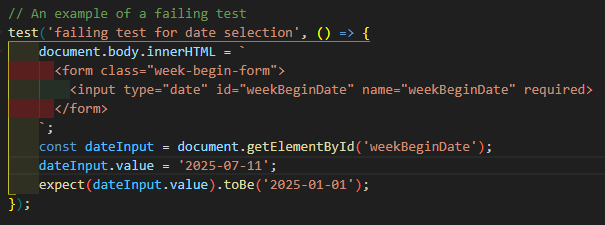
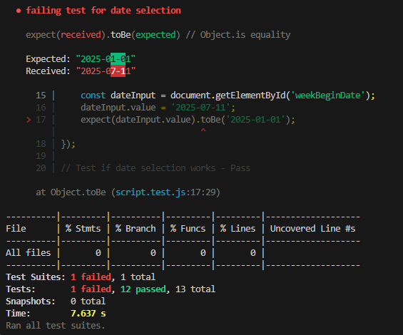

***Figure 11**: The output of a unit test that failed is illustrated in this example. The expected value for the date selection does not correspond with the actual value, resulting in the failure of this unit test.*

**Code needed to pass the test**

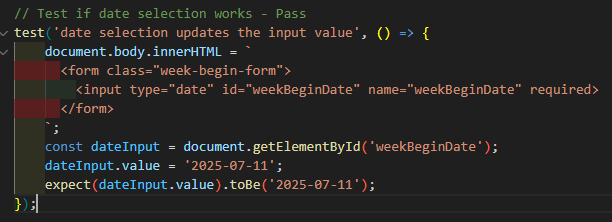
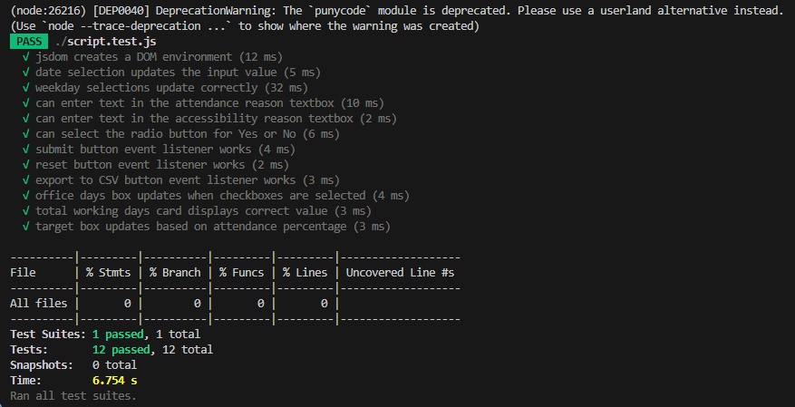

***Figure 12**: The weekday selection is now functioning as intended, as evidenced by the passed unit test in the output.*

I initially tested the weekday selection function and subsequently conducted unit tests on the remaining functions. This approach enabled me to identify defects at an early stage and maintain the robustness, accuracy, and extensibility of my tracker.

## Accessibility Testing

Lighthouse is an automated application that is open-source and was created by Google to evaluate the quality of web pages.  It evaluates the performance, accessibility, SEO, best practices, and features of Progressive Web Apps.  It is crucial to verify that my website is accessible to users with disabilities, as evidenced by the SCS and a typical DfE colleague who requires accessibility.

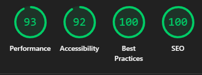

***Figure 13**: The Office Attendance Tracker's Google Lighthouse results are illustrated in the figure.*

### Performance

The OA tracker is highly optimised and operates at an exceptional rate, as indicated by a performance score of 100.  This suggests that the website is responsive to user interactions, loads rapidly, and adheres to the most effective web performance practices.

### Accessibility

The OA tracker is highly accessible to the majority of users, as indicated by an accessibility score of 92.  This suggests that the website adheres to the majority of accessibility standards; however, there are a few minor areas that could be enhanced in order to achieve a faultless score.

### What can be improved

I will need to consult with the product owner during the upcoming sprint to determine how we can improve the product's accessibility.  This is in the form of a ticket, which will be temporarily stored in the product backlog.

</details>

<details closed><summary>8. Future Developments 🔭 </summary>

Please consult the [Kanban Board](https://github.com/users/MrKilljoy137xxx/projects/7), which displays a backlog of ideas that will be executed in subsequent sprints.

</details>
 

<details closed><summary>9. Evaluation 📊 </summary>

In order to guarantee dependability and functionality, the OA tracker underwent an exhaustive evaluation.  Unit tests were developed for all critical functions and user interface components, such as text inputs, weekday checkboxes, and date selection.

The lighthouse results indicate that the tracker satisfies the majority of functional and accessibility requirements, with a performance score of 100 and an accessibility score of 92.  Consequently, accessibility can be enhanced through the implementation of minor enhancements.

As a result, in order to enhance the tracker, user feedback is necessary. This will enable me to identify additional requirements and ensure that they are translated into tickets that can be implemented during the subsequent iteration cycle. Additionally, accessibility should be taken into account from the outset to guarantee that the requirements of the majority of users are satisfied.


</details>
